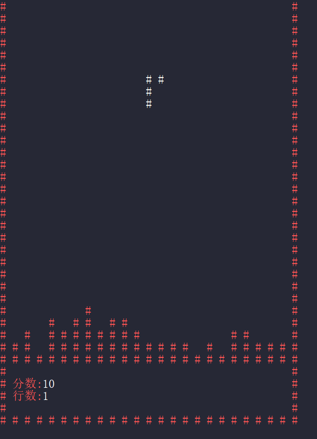

# CSharp_Snake
Classic Console Tetris Game written in C# .NET.

## Control
Use a/d to move left or right, l/r arrow to rotate left or right, s to move down.
## Features
- [ ] change console unit width (2 => 1)
- [ ] show score in end scene
- [ ] record history scores and ranking
## Reference
1. [C#实战附俄罗斯方块实战](https://www.cnblogs.com/abldh12/p/18679068)
